# Quattro 快速启动器

Quattro 是一个 Windows 桌面快速启动器，用来集中管理常用软件、文件、文件夹、网址、系统位置和轻量工具。它以单个 exe 分发，启动后常驻托盘，可以通过主窗口、右键菜单或全局热键快速打开每天反复使用的入口。

## 快速开始

1. 从 Release 下载并运行 `Quattro-x64.exe` 或 `Quattro-x86.exe`。
2. 第一次启动后，在主窗口空白处或托盘图标上右键，添加分组、标签和启动项。
3. 也可以把文件、文件夹、快捷方式或网址直接拖进 Quattro。
4. 在“设置 > 热键”里配置主窗口热键，之后可随时呼出主窗口。
5. 需要迁移配置时，在“设置 > 备份”导出配置包；需要多设备同步时配置 WebDAV。

Quattro 默认可以单 exe 使用。首次运行会自动释放缺失的默认主题、菜单图标和必要组件，并在本机保存配置、数据库和图标缓存。

## 界面导览

### 主窗口

主窗口左侧是标签，顶部是分组，中间是当前标签下的启动项。平铺视图适合图标化入口，列表视图适合大量条目和较长名称。

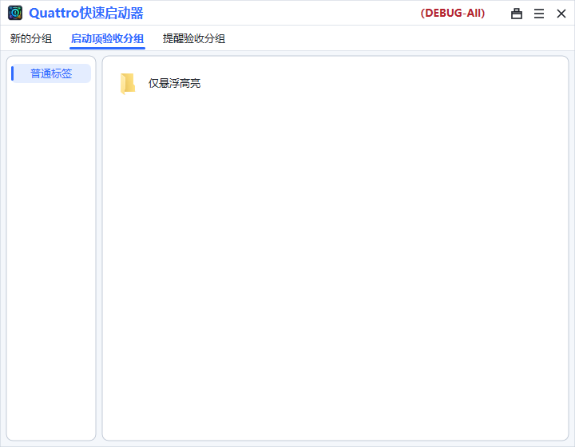

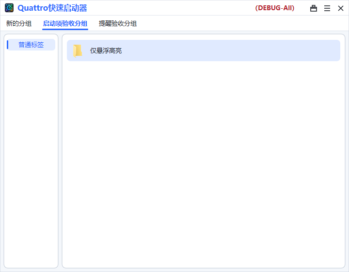

### 编辑启动项

启动项可以是程序、文件、文件夹、网址或系统位置。编辑窗口支持名称、路径、参数、工作目录、备注、图标、单项热键、管理员运行和窗口显示方式。

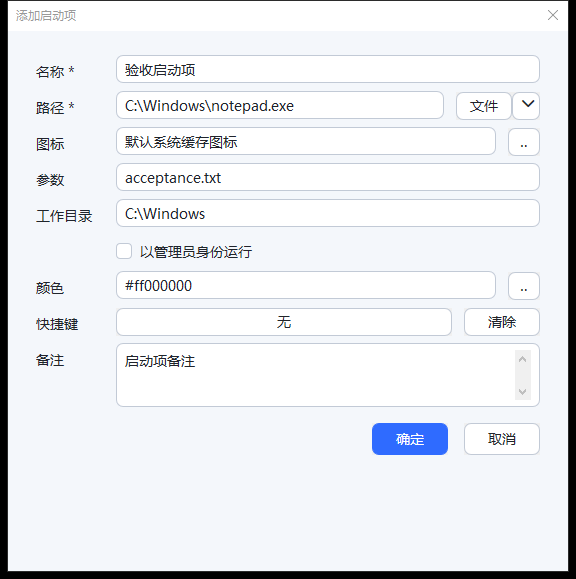

### 快速导入

快速导入适合一次性加入剪贴板里的路径、网址或多行文本；拖拽导入和菜单导入也会进入同一套整理流程。

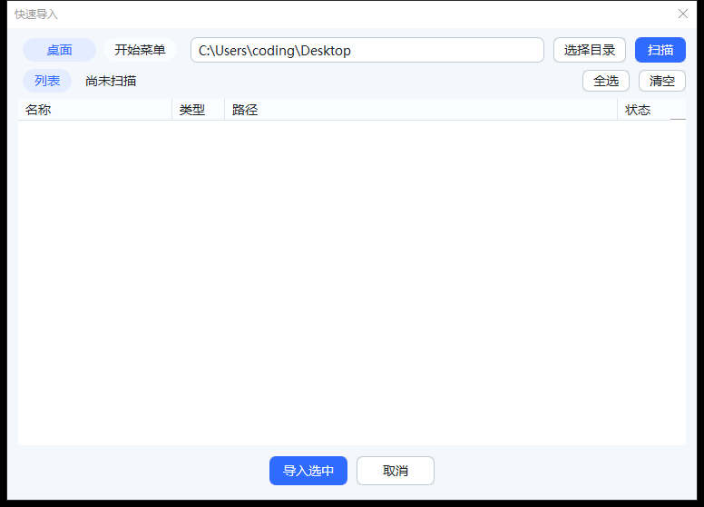

### 待办

待办可以绑定到标签中集中管理，支持启用、禁用、提醒时间和重复规则。到期提醒会在主窗口菜单中显示，可稍后提醒或标记完成。

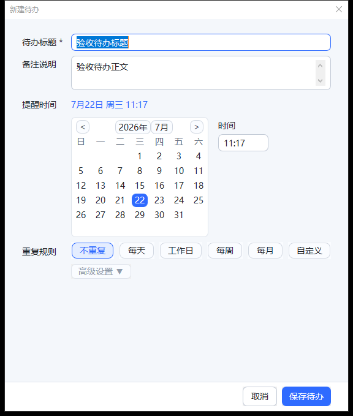

### 设置

设置窗口按使用场景分为多个页面。常用页面包括显示、行为、热键、右键菜单、备份、HTTP 和 WebDAV。

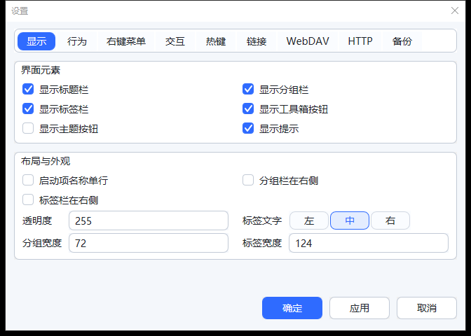

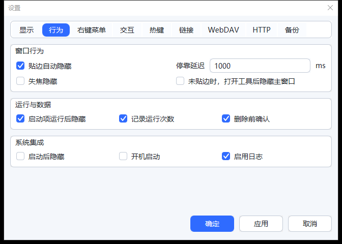

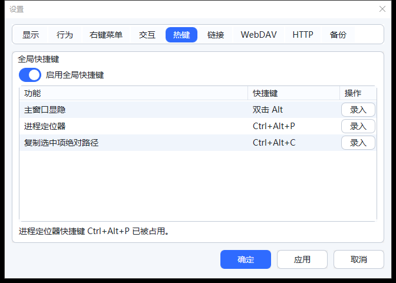

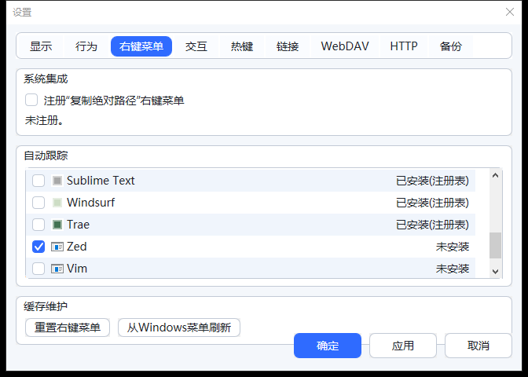

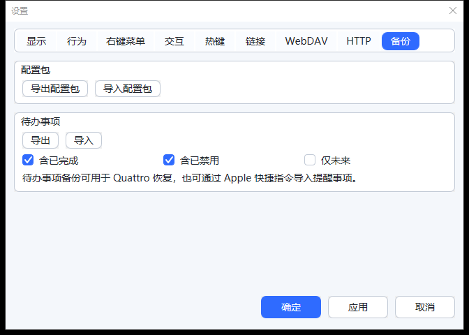

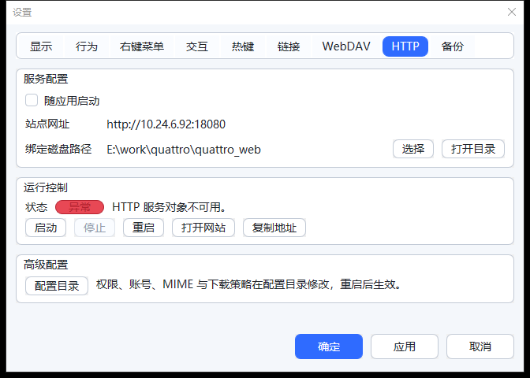

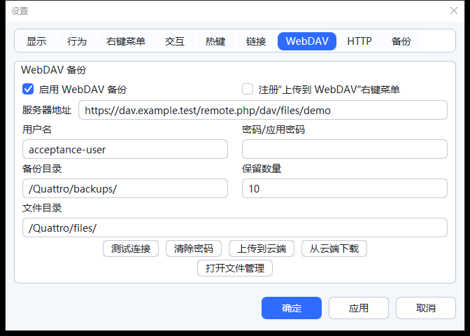

### WebDAV

Quattro 支持把配置包备份到 WebDAV，也可以通过 WebDAV 管理界面查看、下载和删除远端文件。

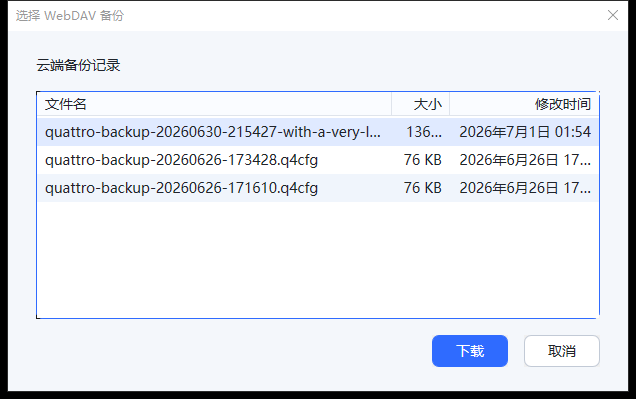

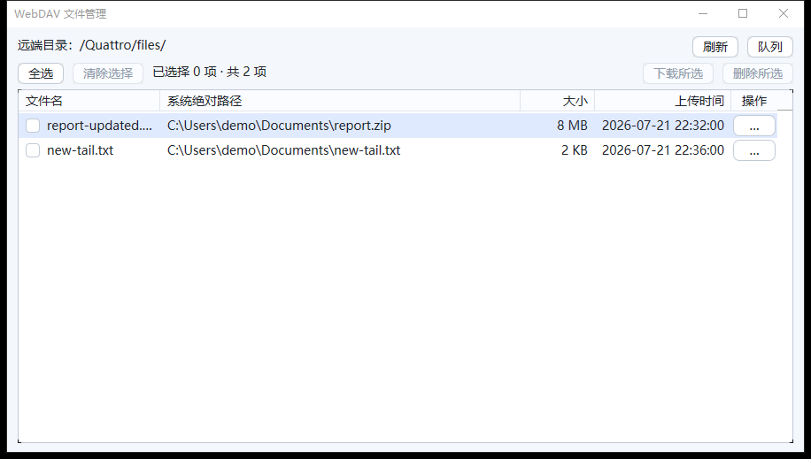

### 内置工具

工具箱提供若干轻量工具，包括计时器、秒表、连点器和进程工具。部分工具会按需请求系统权限，普通使用不会影响 Quattro 主窗口。

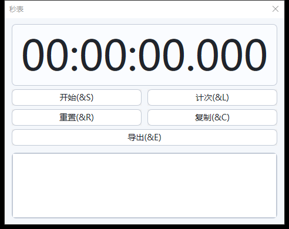

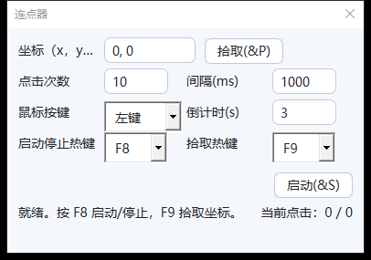

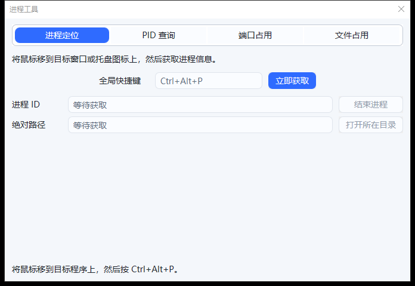

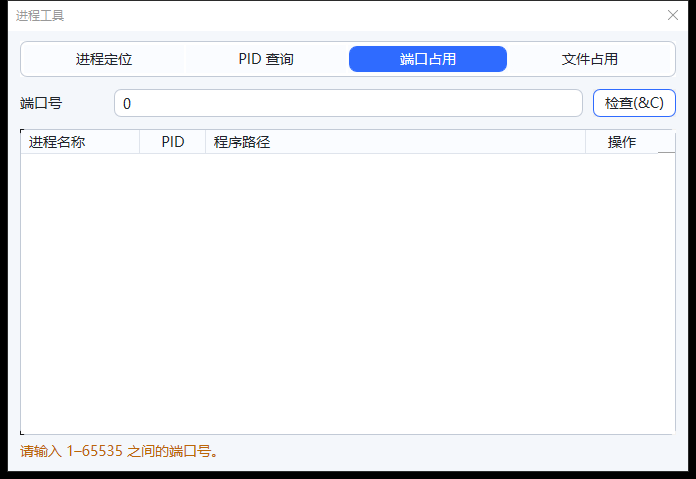

### 广告拦截

广告拦截用于阻止指定文件或文件夹中的可启动程序运行，并可随时解除。

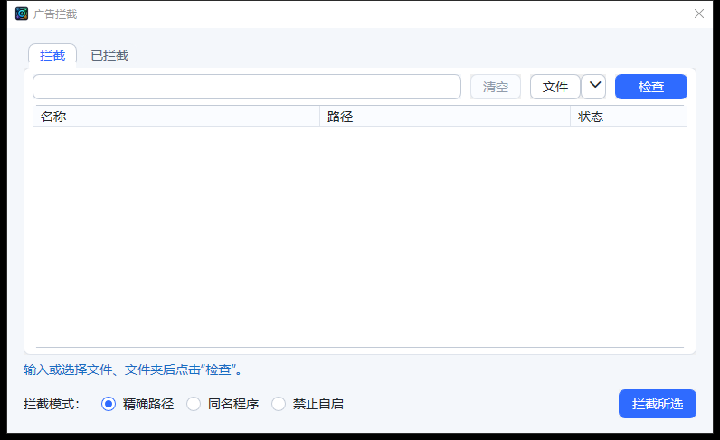

### 检查更新

“检查更新”会读取 GitHub Release 附带的更新清单，确认后下载新版并自动覆盖重启。

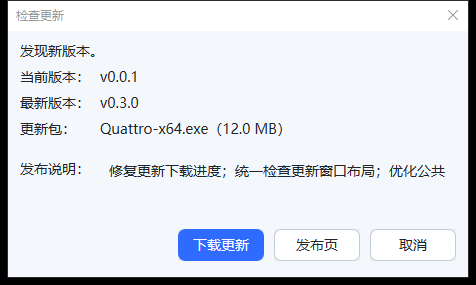

## 常用操作

### 添加启动项

- 拖入文件、文件夹、快捷方式或网址。
- 复制路径或网址后使用“快速导入”。
- 在主窗口右键菜单中选择新增启动项。
- 对系统位置、控制面板项等 Shell 对象，可通过拖拽或系统入口添加。

添加后建议补充清晰名称，并按需要设置参数、工作目录、图标、热键或管理员运行。

### 整理分组和标签

- 分组适合按场景区分，例如“工作”“个人”“维护”。
- 标签适合按用途区分，例如“项目”“文档”“终端”“常用网址”。
- “全部”标签会汇总当前分组下的所有启动项。
- 标签内可以切换平铺或列表视图，调整图标大小，并按名称或运行次数排序。
- 启动项可以移动到其它标签，也可以复制到多个标签。

### 运行和右键菜单

- 单击或双击运行方式可在设置中调整。
- 右键启动项可以运行、编辑、删除、复制路径、打开所在目录、刷新图标或移动/复制到标签。
- 右键菜单可跟踪 Windows 原生 Git、SVN、VS Code、压缩工具和常见终端入口；刷新后会缓存菜单结构和菜单图标。
- URL 启动项会在新增时后台请求一次网站图标，也可以手动更新图标。

### 热键和托盘

- 主窗口热键用于显示 Quattro 主窗口并让它进入前台。
- 单个启动项也可以设置热键，适合高频程序或固定网址。
- 托盘菜单可显示/隐藏主窗口、打开常用命令或退出。
- 可以启用开机自启、贴边隐藏、失焦隐藏和运行后隐藏。

### 备份和迁移

- “配置包”包含配置、启动项数据库、内置工具设置和 URL 图标等常用数据。
- WebDAV 可用于备份、恢复和多设备迁移。
- 待办事项可单独导出 JSON，方便导入 Apple 提醒事项等外部工具。

### HTTP 本地文件服务

HTTP 服务可把指定 Web Root 暴露为本机文件服务。设置页可以启用服务、配置端口、限制是否允许局域网访问，并打开站点或复制地址。详细访问控制写在 Web Root 下的 `http-server.ini` 中，修改后重启服务生效。

## 数据位置

常见文件如下：

- `conf.ini`：窗口、热键、行为、显示和网络配置。
- `db/link.db`：分组、标签、启动项、便签、待办和工具设置。
- `.quattro/context-menu.ini`：右键菜单跟踪设置。
- `.quattro/cache/shell-context-menu.bin`：右键菜单结构与图标缓存。
- `icons/cache/`：启动项图标缓存。
- `icons/url/`：URL 网站图标和自定义 URL 图标。
- `theme/default.xml`：默认主题。

如果 exe 所在目录不可写，Quattro 会改用当前用户的本地数据目录保存运行时文件。

## 常见问题

### 第一次运行为什么会生成文件夹？

Quattro 需要保存配置、启动项数据库、图标缓存、默认资源和按需释放的组件。首次运行自动生成这些目录是正常行为。

### URL 没有网站图标怎么办？

新增网址时，Quattro 会后台请求一次网站的 `favicon.ico`。如果没有成功，可以右键该网址选择“更新图标”，也可以把 `.png` 或 `.ico` 图标放到 `icons/url/`，文件名使用网站 host，例如 `example.com.png`。

### 不能覆盖更新怎么办？

如果 Quattro 正在运行，Windows 会锁定 exe。请先从托盘退出 Quattro，再替换新版 exe。使用内置“检查更新”时，程序会在下载并校验完成后自动处理覆盖和重启。

### 可以只带一个 exe 使用吗？

可以。正式包按单 exe 使用设计，缺失资源会在首次运行时释放；部分辅助组件会在首次使用对应功能时释放到用户目录的版本子目录。

### 我的配置能带到另一台电脑吗？

可以。推荐在“设置 > 备份”导出配置包，在新电脑上导入；如果已经配置 WebDAV，也可以从远端备份恢复。

## 图标与许可

菜单图标使用 Tabler Icons Webfont，项目内位于 `icons/menu/tabler/`，遵循 MIT License。Quattro 自身及第三方依赖的许可信息以仓库内对应文件为准。
