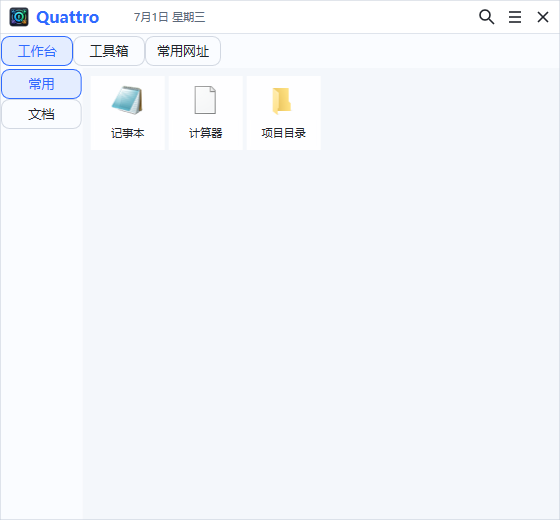
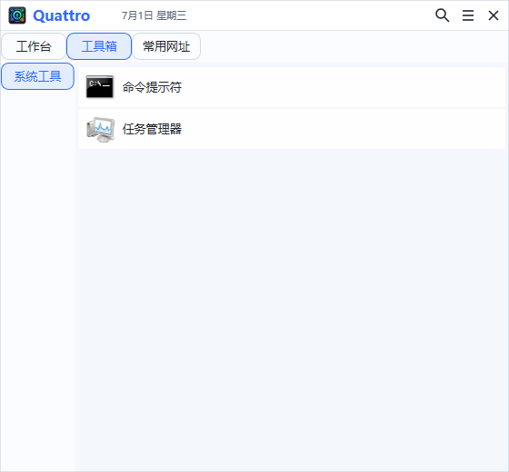

# Quattro快速启动器

Quattro快速启动器 是一个 Windows 桌面快速启动器，用来集中管理常用软件、文件、文件夹、网址和系统位置。它追求轻量、便携、打开快，适合把每天反复使用的入口收进一个紧凑的小面板里。

## 快速开始

1. 下载并运行 `Quattro-x64.exe`。
2. 第一次启动后，右键托盘图标或主窗口空白处添加启动项。
3. 把常用程序、文件、文件夹、网址拖进窗口，也可以复制路径或网址后从菜单导入。
4. 用分组和标签整理入口，例如“工作”“工具”“文档”“常用网址”。
5. 在设置里配置主窗口热键，之后就可以随时呼出 Quattro。

Quattro 默认使用单 exe 方式分发。首次运行会自动释放缺失的默认主题和菜单图标；配置和数据库会在本机运行目录或用户数据目录中生成。

## 界面预览

### 平铺视图



### 列表视图



## 常用功能

- 快速启动：支持打开程序、文件、文件夹、网址和 Windows 系统位置。
- 分组和标签：用顶部分组和侧边标签管理大量启动项。
- 拖拽导入：支持拖入文件、文件夹、文本、URL 和 Shell 对象。
- 右键操作：运行、编辑、删除、复制路径、打开所在目录、移动到标签、复制到标签；可在设置中跟踪并缓存 Windows 原生 Git、SVN、VS Code 和压缩工具菜单，并在刷新时检测 CMD、PowerShell、WSL、WezTerm、Alacritty、Cmder、ConEmu 等可用终端。
- 范围刷新：启动项、普通标签和分组右键菜单均可刷新图标与跟踪菜单；标签和分组刷新仅覆盖其范围内的自定义启动项。
- 菜单图标池：相同原生命令在不同启动项间共享图标缓存，任一启动项成功提取后即可复用。
- 图标显示：自动提取程序、文件、文件夹图标；新增 URL 时会在后台自动请求一次网站图标，也可使用本地图标；系统功能带菜单图标。
- 多种视图：标签内支持列表和平铺布局，也可以调整图标大小。
- 排序管理：支持手动排序、按运行次数/名称自动排序，并用菜单箭头切换正序或倒序。
- 热键呼出：可设置主窗口热键和单个启动项热键。
- 托盘常驻：可从托盘显示/隐藏主窗口、添加启动项或退出。
- 开机自启：在设置中启用或关闭随系统启动。
- 运行统计：记录启动项使用次数，方便按使用频率整理。
- 检查更新：可从菜单读取 GitHub Release 附带的 `latest.json`，确认后下载新版并自动覆盖重启。

## 亮点功能

- 贴边隐藏：窗口可自动停靠到屏幕边缘，鼠标靠近时恢复，减少桌面占用。
- 失焦隐藏：切到其他窗口后自动收起，适合做随叫随到的轻量启动面板。
- 全部标签：自动汇总当前分组下所有启动项。
- 待办标签：可把启动项标记为待办，并集中查看。
- 待办提醒：支持待办启用、禁用和提醒时间。
- Shell 兼容：支持控制面板、系统位置、虚拟 Shell 对象等不只是普通文件路径的入口。
- 管理员运行：启动项可配置为以管理员身份运行。
- 自定义打开目录命令：可按自己的文件管理器习惯打开所在目录。
- WebDAV 备份恢复：可配置 WebDAV，用于配置包备份、恢复和迁移。
- 内置小工具：工具箱默认提供连点器、计时器、秒表等轻量工具。
- 主题系统：通过主题文件统一控制文字、Panel、按钮、输入框、列表、Table、Link、Tooltip、TabControl、ToolBar、GroupBox、菜单、进度条和表单布局等公共组件样式；Panel 统一处理容器状态和滚动，ToolBar 支持动态项目、公共图标项与自动溢出，TabControl 统一处理导航条、页面内容布局及全层级页内快捷键导航，提供 `Standard`、`EmphasizedSegmented`、`MinimalUnderline`、`SoftPill`、`ConnectedTabs` 公共外观语义，并且所有外观均支持 `Horizontal` 和 `Vertical` 排列方向，ComboBox 的项目和选中状态由公共语义接口维护；界面通过 `ThemedUi` 语义接口创建控件。窗口尺寸、布局 metric、组件模板、主题消息框和运行时 `WM_DPICHANGED` 由 `ThemedWindowUi`/`ThemedUi` 按 96-DPI 逻辑像素统一处理，业务窗口不直接计算 DPI。

## 基础用法

### 添加启动项

可以通过以下方式添加：

- 把文件、文件夹或快捷方式拖进 Quattro。
- 复制网址或路径后使用导入入口。
- 在窗口菜单中选择新增启动项。

添加后可以编辑名称、路径、参数、备注、图标、运行方式和待办信息。

### 整理启动项

推荐按“场景”建立分组，再按“用途”建立标签。例如：

- 工作：项目、文档、后台、常用系统工具。
- 个人：网址、影音、素材、下载目录。
- 维护：控制面板、服务、注册表、终端、备份入口。

启动项可以在标签之间移动或复制；标签内可以切换列表/平铺布局，按名称、运行次数正倒序整理，或切回手动排序后拖动/移动位置。

### 备份迁移

Quattro 的配置、启动项数据、内置工具设置和 URL 图标可通过配置包导入导出。需要多设备同步时，可以在设置中配置 WebDAV 备份恢复。

## 文件和数据

- `conf.ini`：本机配置，保存窗口、热键、行为和显示设置。
- `db/link.db`：启动项、分组、标签、待办和内置工具设置等数据。
- `icons/cache/`：运行时生成的图标缓存。
- `icons/url/`：保存 URL 网站图标，也可放置自定义 URL 图标。
- `theme/default.xml`：默认主题。
如果 exe 所在目录不可写，Quattro 会使用当前用户本地数据目录保存运行时文件。

## 常见问题

### 为什么第一次运行会生成一些文件夹？

Quattro 是便携应用，但需要保存你的配置、启动项数据库、图标缓存和默认资源。首次运行时会自动生成缺失目录。

### URL 没有网站图标怎么办？

新增网址时，Quattro 会在后台自动请求一次网站的 `favicon.ico`，成功后保存到 `icons/url/`，不会阻塞主窗口。后续不会自动反复请求；如果网站图标变化，可以右键该网址并选择“更新图标”手动刷新。

也可以把 `.png` 或 `.ico` 图标放入 `icons/url/`，文件名使用网站 host，例如 `example.com.png`。没有可用网站图标或自定义图标时会使用系统或默认图标。

### 程序不能覆盖更新怎么办？

如果 Quattro 正在运行，Windows 会锁定 exe。先从托盘退出 Quattro，再替换新版 exe。

菜单里的“检查更新”默认读取当前仓库 Release 的静态清单：

`https://github.com/codingriver/quattro/releases/latest/download/latest.json`

这样不依赖 GitHub REST API 的匿名请求额度。清单中的 `assets[].sha256` 会在覆盖前校验下载包；如果清单未提供内联 SHA256，但 Release 附带 `SHA256SUMS.txt`，也会继续使用该文件校验。

如果默认 GitHub 链接不可用，程序会按 GitHub 镜像列表顺序兜底；也可以在程序数据目录放置 `update-mirrors.json` 优先追加自定义镜像站点，格式如下：

```json
{
  "version": "0.1.0",
  "githubMirrors": [
    [
      "https://example-mirror.com",
      "https://example-mirror-backup.com"
    ],
    [
      "https://example-mirror.net"
    ]
  ]
}
```

打开“检查更新”时，如果 `update-mirrors.json` 不存在，程序会写入当前版本内置镜像源；如果文件中的 `version` 与当前程序版本不一致，会覆盖写入新版本内置镜像源。检查更新和下载更新均优先使用 GitHub 原链；原链不可用时从第一组第一个镜像开始依次尝试，成功后本次检查和下载使用同一个镜像。程序不会记忆上次成功的镜像，下次启动仍从 GitHub 原链重新开始。

发布时使用 `tools/build.ps1 -Version <版本号>` 会在 `dist/` 生成 `latest.json` 和 `SHA256SUMS.txt`。把它们和对应的 `Quattro-x64.exe` / `Quattro-x86.exe` 一起上传到同一个 GitHub Release 即可。`AppLaunchLocker.exe` 和更新宿主由构建流程内嵌到 Quattro，并在第一次使用对应功能时按版本释放。

后续需要内嵌新的独立 EXE 时，在 CMake 中使用 `quattro_register_embedded_executable(...)` 注册目标、稳定组件 ID 和文件名。统一框架会检查组件版本必须等于 `QUATTRO_VERSION`，生成内嵌数据，并在运行时按 `<组件ID>/<版本>/<文件名>` 释放和校验；业务入口不应自行实现复制、版本判断或哈希逻辑。

GitHub Actions 的手动发布会优先使用仓库 Secret `RELEASE_TOKEN`，未配置时回退到默认 `GITHUB_TOKEN`。如果发布目标提交修改过 `.github/workflows/`，GitHub 会拒绝默认 token 创建或移动 tag；此时需要创建 fine-grained token 或 classic PAT，并授予仓库 `Contents` 写权限和 `Workflows` 权限，然后保存为仓库 Secret `RELEASE_TOKEN`。

### 可以只带一个 exe 使用吗？

可以。默认发布包就是单 exe。缺失的默认资源会在首次运行时释放；自启动管理和更新宿主等独立组件会在第一次使用对应功能时释放到用户目录的版本子目录。

## 图标说明

- 菜单本地图标库使用 Tabler Icons Webfont 3.44.0，项目内文件位于 `icons/menu/tabler/`。
- Tabler Icons 使用 MIT License；许可证文本随图标库保存为 `icons/menu/tabler/LICENSE`。
- 图标来源参考：https://tabler.io/icons 和 https://www.jsdelivr.com/package/npm/@tabler/icons-webfont
# UI 尺寸与间距规范

界面采用 96-DPI 逻辑像素和 4px 基准网格，DPI 换算由 `ThemedWindowUi`、`ThemedUi` 与公共布局层负责。窗口代码不得传入控件高度、字体高度或视觉间距。

- 文本行高：辅助文本 16、正文 20、标题 24。
- 控件高度：Small 24、Medium 28、Large 32；进度条保留 16，纯文本保留 20。
- 行间距：紧密 4、紧凑 6、标准 8、分组 12、主要分区 16。
- 普通 Edit、ComboBox、Button、Tab、列表行和表头统一为 28；CheckBox、Radio、Toggle、Slider 和紧凑按钮统一为 24；Footer 主操作统一为 32。
- GroupBox 标题使用公共 `groupBox.titleInsetY` 控制距上边缘的偏移，标题绘制与内容区域必须共同消费该参数，页面不得自行增加标题 Y 偏移。
- 数值不要求跨语义完全相同，但同一语义必须通过公共主题 metric 或 layout helper 得到相同结果。
